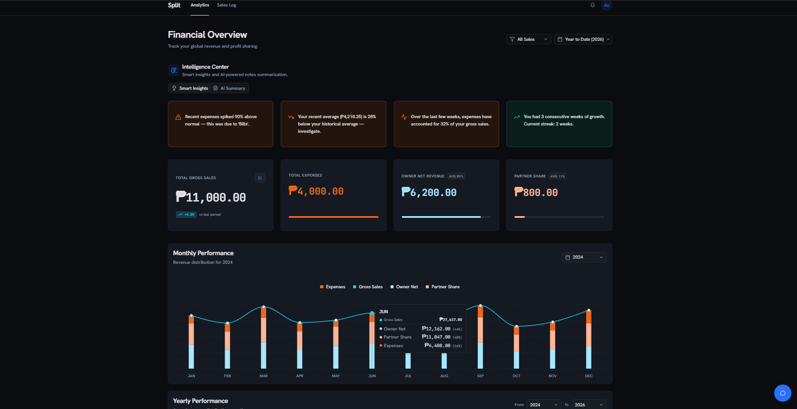
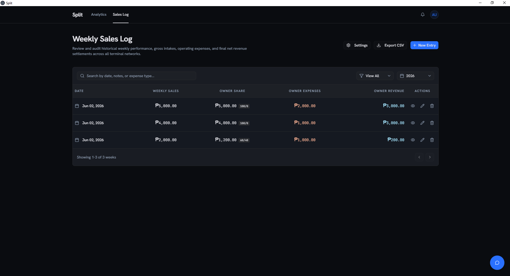
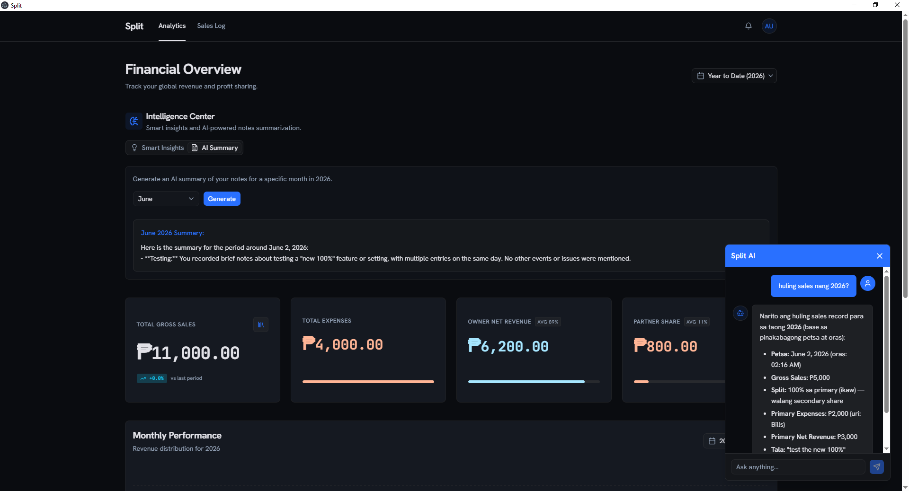
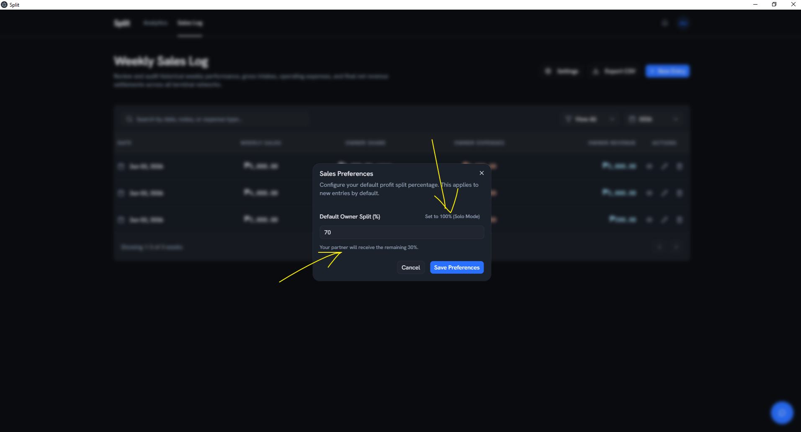
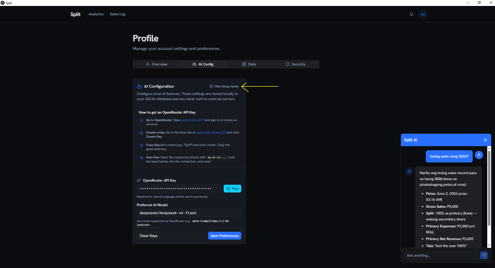

# Split

Split is a modern, local-first financial dashboard and ledger application designed to help businesses efficiently manage daily sales and revenue splits. 

Built on Next.js and packaged as a standalone Windows desktop app via Electron, this application uses a completely local SQLite database, giving you 100% control over your data without relying on any external cloud providers or database services.

## Screenshots

<div align="center">
  
  
  
  
  
</div>
## Features

- **Local-First Architecture:** Powered by a local SQLite database using Prisma. No cloud dependencies required.
- **Desktop Application:** Packaged as a standalone Windows executable (`.exe`) via Electron and `electron-builder`.
- **Dynamic Revenue Splitting:** Automatic calculation of primary and secondary revenue splits based on configurable percentages.
- **Financial Dashboard:** A beautiful, responsive interface for logging and analyzing weekly gross sales, expenses, and net revenue with automatic charting.
- **AI Entry Agent:** Natural language processing allows you to log sales conversationally (e.g., "sales were 5k, spent 300 on router").
- **AI Intelligence Center:** Automatically generates monthly summaries of operational notes to spot business trends.
- **Secure AI Settings:** Plug in your own OpenRouter API key directly in your Profile page. It is stored securely and entirely locally.
- **Built-in Authentication & Offline Recovery:** Fully localized authentication powered by Auth.js. Secures your account with an offline Recovery Key system instead of relying on external email providers.

## Tech Stack

- **Framework:** Next.js (App Router)
- **Desktop Wrapper:** Electron & `electron-builder`
- **Language:** TypeScript
- **Database ORM:** Prisma
- **Database:** SQLite (via `@prisma/adapter-better-sqlite3`)
- **Authentication:** Auth.js (NextAuth.js v5)
- **AI Integration:** Vercel AI SDK (with customizable OpenRouter models)
- **Styling:** Tailwind CSS & shadcn/ui

## Getting Started (Development)

### 1. Install Dependencies

```bash
npm install
```

### 2. Initialize the Database

Since this project uses a local SQLite database, you can generate the database file and tables directly:

```bash
npx prisma db push
```

### 3. Seed the Database (Optional)

If you'd like to populate your local database with dummy data (sales records and test accounts) to test the UI:

```bash
npm run db:seed
```
*(Check `prisma/seed.ts` for the default admin credentials)*

### 4. Run the Application

You can run the app in two ways:

**Run the Web Dev Server (Next.js Only):**
```bash
npm run dev
```
Open [http://localhost:3000](http://localhost:3000) in your browser. *(Note: For web-only dev, you may need to manually create a `.env` file with `DATABASE_URL` and `AUTH_SECRET`).*

**Run the Electron Desktop App (Recommended):**
```bash
npm run desktop
```
This boots the Next.js production build inside the native Electron shell.

### 5. Packaging for Production

To compile and package the app into a Windows installer (`.exe`):

```bash
npm run dist
```
The resulting installer will be located in the `dist/` directory.

### Managing the Database

You can view and modify your local SQLite database at any time using Prisma Studio:

```bash
npx prisma studio
```
This will open a visual database editor at [http://localhost:5555](http://localhost:5555).

## Contributing

Contributions are welcome! Please feel free to submit a Pull Request.

## License

This project is licensed under the MIT License - see the [LICENSE](LICENSE) file for details.
